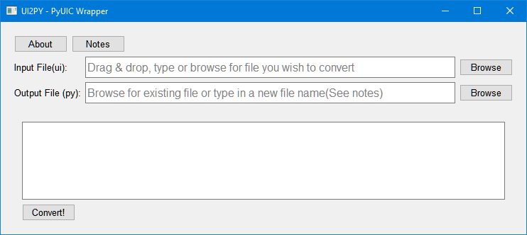

# Ui2Py

___

A simple GUI wrapper for the PYQt5 UIC tool.  
It makes quick and simple work of converting a QT Designer ui file to a py file.   

If you are a poor typist like me then this little tool is for you.

## Prerequisites

___
1. Python 3.9  
2. PyQt5 5.15.1 or greater  
(Not tested with earlier releases but may work)  
3. Windows OS (Developed on 10 but should work with 7 or 8)

## Getting Started

___
Option 1 - Clone the repo  
Option 2 - Grab the .exe from the exe directory  

## Screenshot
___

## Built With
___
[PyCharm Community 2020.3](https://www.jetbrains.com/pycharm/)  

## Author
___
Steve Earl

## License
___
This project is licensed under Apache License - Version 2.0  
See [license.txt](License.txt) file for more information
